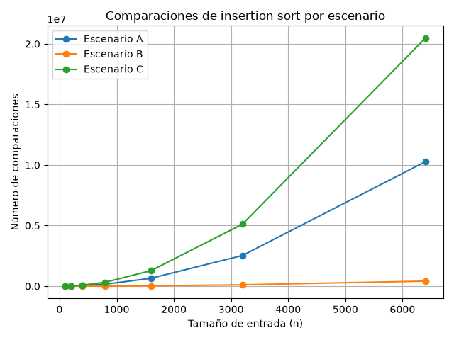
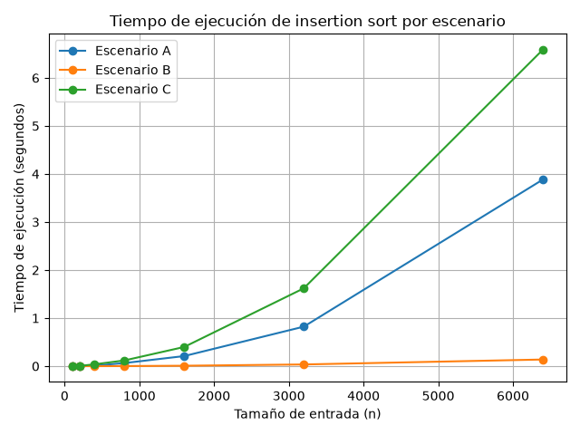

# Laboratorio 1 — Fundamentos, complejidad y recurrencias

**Nombre completo:** ESNEIDER GUISAO OSPINA

## 1. Instrucciones para reproducir

Para ejecutar el laboratorio se debe tener Python instalado y activar el entorno virtual del proyecto.

Desde la carpeta `lab1-fundamentos-complejidad-recurrencias`:

```bash
python parte3_casos.py
```

## Parte 1 — Analizar el algoritmo antes de comprar el servidor

- Yo creo que porque el proceso de Tamiza lleve ocho años funcionando no significa que todavía sea adecuado para la cantidad de datos que maneja actualmente. Hace algunos años podía funcionar bien porque seguramente había menos registros, pero ahora tiene que ordenar alrededor de 1,2 millones de registros todas las noches.
- Para mí, hay una diferencia entre que el algoritmo sea correcto y que cumpla con el tiempo que tiene disponible. Es correcto cuando al final los registros quedan ordenados de mayor a menor riesgo, que es lo que necesita Tamiza. Pero eso no es suficiente, porque el proceso también tiene un límite de tiempo, debe terminar entre las 2:00 a. m. y las 6:00 a. m. El problema es que ya ha ocurrido tres veces que no alcanza a terminar antes de las 6:00 a. m. y la lista queda incompleta.
- Por eso, antes de comprar un servidor con el doble de velocidad, primero revisaría el algoritmo. Un servidor más rápido podría hacer que el proceso tarde menos, pero el algoritmo seguiría haciendo el mismo tipo de trabajo. Si para ordenar 1,2 millones de registros necesita realizar demasiadas operaciones, aumentar la velocidad del servidor no solucionaría completamente el problema. Además, si la cantidad de registros sigue creciendo, la situación podría volver a presentarse.
- Un ejemplo diferente sería un sistema que tenga que procesar una campaña de 100.000 mensajes de WhatsApp. Supongamos que el sistema procesa todos los mensajes correctamente, pero tarda cuatro horas y la campaña necesita estar lista en una hora. En ese caso el sistema está dando el resultado esperado, pero no está cumpliendo con el tiempo que necesita el proceso.
- Por eso considero que primero se debería medir cuánto tarda el algoritmo con una cantidad de datos similar a la que maneja Tamiza. Con esa información se podría determinar si realmente es necesario aumentar la capacidad del servidor o si también se debe cambiar el algoritmo.

## Parte 2 — Responsabilidad ambiental y ética de la implementación

- Si yo estuviera a cargo de la parte técnica de Tamiza, no me podría quedar solo en la discusión de si el algoritmo sirve o no. Tendría que pensar en lo que pasa cada madrugada cuando se procesan esos 1,2 millones de registros de pacientes y en el impacto que puede tener el proceso.

- Algo que también tendría en cuenta es el consumo de energía. El proceso se ejecuta durante la noche y, mientras el servidor está trabajando con los datos, está consumiendo energía y recursos. Si el proceso tarda más de lo necesario y esto se repite todas las noches durante años, ese consumo adicional se va acumulando. Por eso, mejorar el algoritmo no sería solamente un tema de hacer que el programa sea más rápido, también evitaría mantener los recursos trabajando durante más tiempo del necesario.

- Lo que más me preocuparía, de todas formas, es lo que puede pasar con los pacientes. Si una noche el proceso falla, se demora demasiado o queda a la mitad, la lista puede quedar incompleta. Puede haber pacientes que no sean incluidos en las llamadas programadas y tengan que esperar más tiempo para ser contactados. En este caso, quien termina asumiendo el costo es el paciente, aunque el problema haya comenzado en el sistema.

- Y si pensamos en lo que ocurre al otro lado, está el operador del centro de contacto. Si llega a las 6:00 a. m. y encuentra una lista incompleta o que no quedó bien organizada, le tocará revisar qué pasó y tratar de trabajar con la información disponible. Esto puede quitarle tiempo y generar confusión durante la jornada. Al final, el operador termina enfrentando un problema que no fue causado por él.

- Hay otra cosa que me parece todavía más importante en este caso. La lista no se ordena solamente para tener los datos organizados. El orden indica qué pacientes se deben contactar primero de acuerdo con su nivel de riesgo. Entonces, no serviría de mucho que el proceso termine antes de las 6:00 a. m. si los registros quedaron en un orden equivocado.

- Por ejemplo, si un paciente tiene un nivel de riesgo mayor y termina después de otro que debería ser contactado más tarde, se estaría cambiando la prioridad de las llamadas. En ese punto ya no sería solamente un problema de que el sistema se demoró, porque el error podría afectar directamente la forma en que se atiende a una persona.

- Por eso, al escoger el algoritmo yo tendría que mirar más que el tiempo de ejecución. También tendría que asegurarme de que el resultado sea correcto y que la lista que recibe el centro de contacto realmente refleje las prioridades de los pacientes. Como el proceso se repite todas las noches, una decisión que parece solamente técnica puede terminar teniendo consecuencias para muchas personas.

## Parte 3 — Mejor, peor y caso promedio: demostración práctica

Código utilizado para esta parte:

- [Experimento de la Parte 3](parte3_casos.py)
- [Algoritmos de ordenamiento](algoritmos.py)
- [Generadores de datos](datos.py)

### 3.1 — Explicación

- Cuando hablamos del mejor, peor y caso promedio de un algoritmo, tenemos que comparar entradas que tengan el mismo tamaño. Por ejemplo, si tenemos una lista de n elementos, podemos mirar cómo se comporta el algoritmo con las diferentes formas en que pueden estar organizados esos mismos n elementos.

- El mejor caso sería cuando el algoritmo tiene que hacer la menor cantidad de trabajo posible con una entrada de tamaño n. En el caso de insertion sort, esto pasa cuando los datos ya están ordenados como los necesitamos. Por eso casi no tiene que hacer movimientos para organizarlos.

- El peor caso sería cuando, con esos mismos n elementos, el algoritmo tiene que hacer la mayor cantidad de trabajo. En insertion sort esto ocurre cuando los datos vienen en el orden contrario al que necesitamos, porque los elementos tienen que ir pasando uno por uno hasta encontrar su posición.

- El caso promedio sería el comportamiento que se obtiene al considerar las diferentes entradas posibles de un mismo tamaño n y sacar un promedio del trabajo que realiza el algoritmo. Para este ejercicio, el escenario que más se acerca a esta situación es el de los datos aleatorios, porque no tienen un orden definido y algunos elementos tendrán que moverse más que otros.

- Para decidir si insertion sort debería utilizarse en producción en Tamiza, yo me fijaría principalmente en el peor caso. Esto se debe a que el proceso solamente tiene cuatro horas para terminar. Si nos basamos únicamente en que normalmente los datos llegan en una situación favorable, podría presentarse una noche en la que los datos estén en un orden más complicado y el proceso no alcance a terminar antes de las 6:00 a. m.

- Antes de realizar las pruebas, mi predicción es que el escenario B será el mejor caso, porque el 98 % de los registros ya está en el orden que necesitamos y solamente hay un pequeño grupo de registros nuevos al final. El escenario C será el peor caso, porque los datos vienen completamente al contrario del orden requerido. Por último, espero que el escenario A se acerque al caso promedio, ya que los registros están organizados aleatoriamente.

- Esta es mi predicción antes de hacer las mediciones. Después de ejecutar las pruebas en python, compararé los resultados para comprobar si los tres escenarios realmente se comportan como esperaba.

### 3.2 — Resultados del experimento

- Para realizar las pruebas utilicé los tres escenarios con los tamaños de entrada de 100, 200, 400, 800, 1600, 3200 y 6400 registros. El tiempo se midió solamente durante la ejecución de `insertion_sort`, utilizando `time.perf_counter()`. Los datos se generaron antes de iniciar el cronómetro para no incluir ese tiempo en la medición.

- Los resultados muestran una diferencia clara entre los tres escenarios. En todos los tamaños probados, el escenario B fue el que necesitó menos comparaciones y menos tiempo. Por ejemplo, con 6400 registros realizó 414738 comparaciones y tardó aproximadamente 0.138 segundos.

- El escenario C fue el que presentó el mayor número de comparaciones y el mayor tiempo de ejecución. Con 6400 registros realizó 20476800 comparaciones y tardó aproximadamente 6.587 segundos. Esto coincide con lo esperado para el caso en el que los datos llegan completamente en el orden contrario al que necesita el algoritmo.

- El escenario A quedó entre los otros dos. Para 6400 registros realizó 10276753 comparaciones y tardó aproximadamente 3.884 segundos. Por su comportamiento con datos aleatorios, es el escenario que se aproxima al caso promedio.

- Por lo tanto, los resultados de la prueba coinciden con mi predicción de la sección 3.1: el escenario B corresponde al mejor caso, el escenario C al peor caso y el escenario A se aproxima al caso promedio.

### Comparaciones por escenario



### Tiempo de ejecución por escenario



