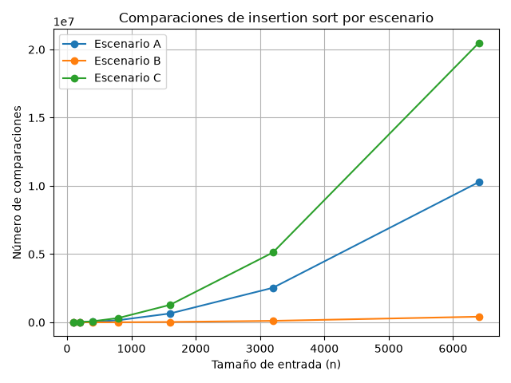
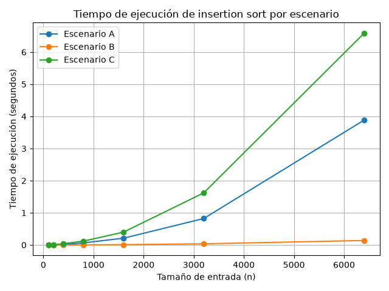
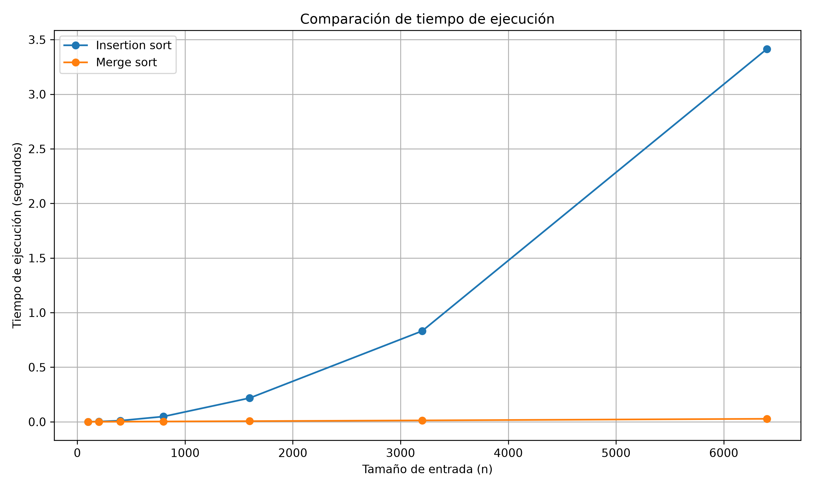

# Laboratorio 1 — Fundamentos, complejidad y recurrencias

**Nombre completo:** ESNEIDER GUISAO OSPINA

## 1. Instrucciones para reproducir

Para ejecutar el laboratorio se debe tener Python instalado y ubicarse en la carpeta raíz del proyecto. Se recomienda utilizar el entorno virtual para instalar y ejecutar las dependencias.

### Windows

Desde la carpeta raíz del proyecto:

```cmd
venv\Scripts\activate
cd lab1-fundamentos-complejidad-recurrencias
python parte3_casos.py
python parte4_complejidad.py
```

### Linux/Mac

source venv/bin/activate
cd lab1-fundamentos-complejidad-recurrencias
python3 parte3_casos.py
python3 parte4_complejidad.py

## Parte 1 — Analizar el algoritmo antes de comprar el servidor

- Yo creo que porque el proceso de Tamiza lleve ocho años funcionando no significa que todavía sea adecuado para la cantidad de datos que maneja actualmente. Hace algunos años podía funcionar bien porque seguramente había menos registros, pero ahora tiene que ordenar alrededor de 1,2 millones de registros todas las noches.
- Para mí, hay una diferencia entre que el algoritmo sea correcto y que cumpla con el tiempo que tiene disponible. Es correcto cuando al final los registros quedan ordenados de mayor a menor riesgo, que es lo que necesita Tamiza. Pero eso no es suficiente, porque el proceso también tiene un límite de tiempo, debe terminar entre las 2:00 a. m. y las 6:00 a. m. El problema es que ya ha ocurrido tres veces que no alcanza a terminar antes de las 6:00 a. m. y la lista queda incompleta.
- Por eso, antes de comprar un servidor con el doble de velocidad, primero revisaría el algoritmo. Un servidor más rápido podría reducir el tiempo de ejecución, pero no cambia la cantidad de trabajo que el algoritmo necesita realizar. En este caso, el insertion sort tiene un crecimiento cuadrático, por lo que al aumentar mucho la cantidad de registros, el trabajo puede crecer mucho más rápido que la mejora que proporciona duplicar la velocidad del servidor. Por ejemplo, si el volumen de datos sigue aumentando, una mejora de 2 veces en el servidor no significa que el algoritmo vaya a necesitar 2 veces menos trabajo. Por eso, aunque el servidor pueda ayudar temporalmente, el problema de fondo seguiría estando en el crecimiento del algoritmo y podría volver a incumplirse la ventana de cuatro horas.
- Un ejemplo diferente sería un sistema que tenga que procesar una campaña de 100.000 mensajes de WhatsApp. Supongamos que el sistema debe tomar los números de los clientes, validar los datos, preparar cada mensaje y enviarlos correctamente. El algoritmo puede hacer todo este proceso sin errores, pero si tarda cuatro horas y la campaña necesita estar preparada y enviada en una hora, el sistema resulta inviable para esa situación. El problema no sería que los mensajes estén mal procesados, sino que el tiempo necesario supera la restricción de una hora. Esto podría ser especialmente importante, por ejemplo si los mensajes corresponden a confirmaciones de citas que deben enviarse antes de una determinada hora.
- Por eso considero que primero se debería medir cuánto tarda el algoritmo con una cantidad de datos similar a la que maneja Tamiza. Con esa información se podría determinar si realmente es necesario aumentar la capacidad del servidor o si también se debe cambiar el algoritmo.

## Parte 2 — Responsabilidad ambiental y ética de la implementación

- Si yo estuviera a cargo de la parte técnica de Tamiza, no me podría quedar solo en la discusión de si el algoritmo sirve o no. Tendría que pensar en lo que pasa cada madrugada cuando se procesan esos 1,2 millones de registros de pacientes y en el impacto que puede tener el proceso.

- Algo que también tendría en cuenta es el consumo de energía. El proceso se ejecuta durante la noche y, mientras el servidor está trabajando con los datos, está consumiendo energía y recursos. Si el proceso tarda más de lo necesario y esto se repite todas las noches durante años, ese consumo adicional se va acumulando. Por eso, mejorar el algoritmo no sería solamente un tema de hacer que el programa sea más rápido, también evitaría mantener los recursos trabajando durante más tiempo del necesario.

- Lo que más me preocuparía, de todas formas, es lo que puede pasar con los pacientes. Si una noche el proceso falla, se demora demasiado o queda a la mitad, la lista puede quedar incompleta. Puede haber pacientes que no sean incluidos en las llamadas programadas y tengan que esperar más tiempo para ser contactados. En este caso, quien termina asumiendo el costo es el paciente, aunque el problema haya comenzado en el sistema.

- Y si pensamos en lo que ocurre al otro lado, está el operador del centro de contacto. Si llega a las 6:00 a. m. y encuentra una lista incompleta o que no quedó bien organizada, le tocará revisar qué pasó y tratar de trabajar con la información disponible. Esto puede quitarle tiempo y generar confusión durante la jornada. Al final, el operador termina enfrentando un problema que no fue causado por él.

- Hay otra cosa que me parece todavía más importante en este caso. La lista no se ordena solamente para tener los datos organizados. El orden indica qué pacientes se deben contactar primero de acuerdo con su nivel de riesgo. Entonces, no serviría de mucho que el proceso termine antes de las 6:00 a. m. si los registros quedaron en un orden equivocado.

- Por ejemplo, si un paciente tiene un nivel de riesgo mayor y termina después de otro que debería ser contactado más tarde, se estaría cambiando la prioridad de las llamadas. En ese punto ya no sería solamente un problema de que el sistema se demoró, porque el error podría afectar directamente la forma en que se atiende a una persona.

- Por eso, al escoger el algoritmo yo tendría que mirar más que el tiempo de ejecución. También tendría que asegurarme de que el resultado sea correcto y que la lista que recibe el centro de contacto realmente refleje las prioridades de los pacientes. Como el proceso se repite todas las noches, una decisión que parece solamente técnica puede terminar teniendo consecuencias para muchas personas.

## Parte 3 — Mejor, peor y caso promedio: demostración práctica

Código utilizado para esta parte:

- [Experimento de la Parte 3](parte3_casos.py)
- [Algoritmos de ordenamiento](algoritmos.py)
- [Generadores de datos](datos.py)

### 3.1 — Explicación

- Cuando hablamos del mejor, peor y caso promedio de un algoritmo, tenemos que comparar entradas que tengan el mismo tamaño. Por ejemplo, si tenemos una lista de n elementos, podemos mirar cómo se comporta el algoritmo con las diferentes formas en que pueden estar organizados esos mismos n elementos.

- El mejor caso sería cuando el algoritmo tiene que hacer la menor cantidad de trabajo posible con una entrada de tamaño n. En el caso de insertion sort, esto pasa cuando los datos ya están ordenados como los necesitamos. Por eso casi no tiene que hacer movimientos para organizarlos.

- El peor caso sería cuando, con esos mismos n elementos, el algoritmo tiene que hacer la mayor cantidad de trabajo. En insertion sort esto ocurre cuando los datos vienen en el orden contrario al que necesitamos, porque los elementos tienen que ir pasando uno por uno hasta encontrar su posición.

- El caso promedio sería el comportamiento que se obtiene al considerar las diferentes entradas posibles de un mismo tamaño n y sacar un promedio del trabajo que realiza el algoritmo. Para este ejercicio, el escenario que más se acerca a esta situación es el de los datos aleatorios, porque no tienen un orden definido y algunos elementos tendrán que moverse más que otros.

- Para decidir si insertion sort debería utilizarse en producción en Tamiza, yo me fijaría principalmente en el peor caso. Esto se debe a que el proceso solamente tiene cuatro horas para terminar. Si nos basamos únicamente en que normalmente los datos llegan en una situación favorable, podría presentarse una noche en la que los datos estén en un orden más complicado y el proceso no alcance a terminar antes de las 6:00 a. m.

- Antes de realizar las pruebas, mi predicción es que el escenario B será el mejor caso, porque el 98 % de los registros ya está en el orden que necesitamos y solamente hay un pequeño grupo de registros nuevos al final. El escenario C será el peor caso, porque los datos vienen completamente al contrario del orden requerido. Por último, espero que el escenario A se acerque al caso promedio, ya que los registros están organizados aleatoriamente.

- Esta es mi predicción antes de hacer las mediciones. Después de ejecutar las pruebas en python, compararé los resultados para comprobar si los tres escenarios realmente se comportan como esperaba.

### 3.2 — Resultados del experimento

- Para realizar las pruebas utilicé los tres escenarios con los tamaños de entrada de 100, 200, 400, 800, 1600, 3200 y 6400 registros. El tiempo se midió solamente durante la ejecución de `insertion_sort`, utilizando `time.perf_counter()`. Los datos se generaron antes de iniciar el cronómetro para no incluir ese tiempo en la medición.

- Los resultados muestran una diferencia clara entre los tres escenarios. En todos los tamaños probados, el escenario B fue el que necesitó menos comparaciones y menos tiempo. Por ejemplo, con 6400 registros realizó 414738 comparaciones y tardó aproximadamente 0.138 segundos.

- El escenario C fue el que presentó el mayor número de comparaciones y el mayor tiempo de ejecución. Con 6400 registros realizó 20476800 comparaciones y tardó aproximadamente 6.587 segundos. Esto coincide con lo esperado para el caso en el que los datos llegan completamente en el orden contrario al que necesita el algoritmo.

- El escenario A quedó entre los otros dos. Para 6400 registros realizó 10276753 comparaciones y tardó aproximadamente 3.884 segundos. Por su comportamiento con datos aleatorios, es el escenario que se aproxima al caso promedio.

- Por lo tanto, los resultados de la prueba coinciden con mi predicción de la sección 3.1: el escenario B corresponde al mejor caso, el escenario C al peor caso y el escenario A se aproxima al caso promedio.

### Comparaciones por escenario



### Tiempo de ejecución por escenario



# Parte 4 — Complejidad de merge sort e insertion sort: cálculo y validación

### 4.1 — Cálculo teórico

#### Complejidad de merge sort

Código utilizado para esta parte:

- [Experimento de la Parte 4](parte4_complejidad.py)
- [Algoritmos de ordenamiento](algoritmos.py)
- [Generadores de datos](datos.py)

Para merge sort, el algoritmo divide la lista en dos partes aproximadamente iguales y aplica el mismo procedimiento a cada una. Después de ordenar las dos partes, las combina en una sola lista ordenada.

Por esta razón, la recurrencia es:

\[
T(n) = 2T(n/2) + \Theta(n)
\]

Cada término representa una parte del trabajo:

- `2T(n/2)`: representa el costo de resolver los dos subproblemas, cada uno con aproximadamente la mitad de los elementos.
- `\Theta(n)`: corresponde al proceso de combinar las dos partes ordenadas. Para hacerlo hay que recorrer los elementos de ambas partes y construir nuevamente la lista ordenada.

#### Cálculo manual de insertion sort

Código utilizado para esta parte:

- [Experimento de la Parte 4](parte4_complejidad.py)
- [Algoritmos de ordenamiento](algoritmos.py)
- [Generadores de datos](datos.py)

Para realizar el cálculo manual voy a utilizar la misma implementación de `insertion_sort` utilizada en el experimento:

```python
lista = datos.copy()

comparaciones = 0

for i in range(1, len(lista)):

    j = i

    while j > 0:

        comparaciones += 1

        if lista[j - 1] >= lista[j]:

            break

        lista[j - 1], lista[j] = lista[j], lista[j - 1]

        j -= 1

return lista, comparaciones
```

##### Mejor caso

El mejor caso ocurre cuando los datos ya están ordenados en el mismo sentido en que los necesita Tamiza, es decir, de mayor riesgo a menor riesgo.

En este caso, el algoritmo entra una sola vez al ciclo `while` para cada posición. La comparación realizada por el `if` permite detener inmediatamente el proceso porque los elementos ya están en el orden correcto.

| Línea | Veces que se ejecuta |
| --- | ---: |
| `lista = datos.copy()` | 1 |
| `comparaciones = 0` | 1 |
| `for i in range(1, len(lista))` | `n - 1` |
| `j = i` | `n - 1` |
| `while j > 0` | `n - 1` |
| `comparaciones += 1` | `n - 1` |
| `if lista[j - 1] >= lista[j]` | `n - 1` |
| `break` | `n - 1` |
| Intercambio | 0 |
| `j -= 1` | 0 |
| `return lista, comparaciones` | 1 |

En el mejor caso, el ciclo externo se ejecuta `n - 1` veces y en cada iteración se realiza una sola comparación entre elementos. Por lo tanto, el crecimiento del trabajo es proporcional a `n`.

La complejidad temporal del mejor caso es:

\[
\boxed{T(n)=\Theta(n)}
\]

Aunque en la tabla `lista = datos.copy()` aparece como una sola ejecución de la instrucción, la copia internamente debe recorrer los elementos de la lista. Esto también tiene un costo lineal. Por lo tanto, el resultado general del mejor caso sigue siendo `\Theta(n)`.

##### Peor caso

El peor caso ocurre cuando los datos están completamente en el orden contrario al que necesita Tamiza. Por ejemplo, para una lista de 10 elementos:

```text
[0, 1, 2, 3, 4, 5, 6, 7, 8, 9]
```

En este caso, los elementos deben desplazarse prácticamente hasta el extremo contrario de la lista para quedar ordenados de mayor a menor.

La cantidad de veces que se ejecutan las instrucciones que dependen del ciclo `while` aumenta en cada iteración del ciclo externo:

| Línea | Veces que se ejecuta |
| --- | ---: |
| `lista = datos.copy()` | 1 |
| `comparaciones = 0` | 1 |
| `for i in range(1, len(lista))` | `n - 1` |
| `j = i` | `n - 1` |
| `while j > 0` | \(\frac{n(n-1)}{2}\) |
| `comparaciones += 1` | \(\frac{n(n-1)}{2}\) |
| `if lista[j - 1] >= lista[j]` | \(\frac{n(n-1)}{2}\) |
| Intercambio | \(\frac{n(n-1)}{2}\) |
| `j -= 1` | \(\frac{n(n-1)}{2}\) |
| `break` | 0 |
| `return lista, comparaciones` | 1 |

Para entender de dónde sale esta cantidad, se puede observar el número de comparaciones realizadas en cada iteración:

```text
i = 1  → 1 comparación
i = 2  → 2 comparaciones
i = 3  → 3 comparaciones
...
i = n-1 → n-1 comparaciones
```

Por lo tanto, la cantidad total de comparaciones es:

\[
1+2+3+\cdots +(n-1)
\]

La suma de los primeros `n - 1` números enteros positivos es:

\[
\frac{n(n-1)}{2}
\]

Por ejemplo, si:

\[
n=5
\]

entonces:

\[
1+2+3+4=10
\]

y utilizando la fórmula:

\[
\frac{5(5-1)}{2}
=
\frac{5(4)}{2}
=
10
\]

Por lo tanto, el número de comparaciones en el peor caso es:

\[
\frac{n(n-1)}{2}
\]

Desarrollando la expresión:

\[
\frac{n(n-1)}{2}
=
\frac{n^2-n}{2}
\]

o también:

\[
\frac{1}{2}n^2-\frac{1}{2}n
\]

El término que domina el crecimiento cuando `n` aumenta es:

\[
n^2
\]

Por lo tanto, la complejidad temporal del peor caso es:

\[
\boxed{T(n)=\Theta(n^2)}
\]

##### Caso promedio

El caso promedio representa el comportamiento del algoritmo cuando se consideran diferentes arreglos posibles de los datos para un mismo tamaño `n`. En el experimento de Tamiza, este comportamiento se aproxima utilizando datos generados aleatoriamente.

En una entrada aleatoria, algunos elementos pueden encontrarse cerca de la posición que les corresponde, mientras que otros pueden necesitar varios desplazamientos. Por esta razón, el trabajo realizado se encuentra entre el comportamiento del mejor y del peor caso.

En promedio, un elemento debe desplazarse aproximadamente una cantidad intermedia de las posiciones que podría recorrer. Por esta razón, el número de desplazamientos y comparaciones crece proporcionalmente al número de pares de elementos que pueden encontrarse en un orden que requiera desplazamiento.

La suma:

\[
1+2+3+\cdots +(n-1)
\]

representa el crecimiento máximo utilizado anteriormente para el peor caso. En el caso promedio no se debe interpretar esta suma como el número exacto de comparaciones que siempre se realizan, sino como una referencia para observar el orden de crecimiento. En una entrada aleatoria se realizan, en promedio, menos desplazamientos que en el peor caso, pero el crecimiento continúa siendo cuadrático.

La suma completa del peor caso es:

\[
\frac{n(n-1)}{2}
=
\frac{n^2-n}{2}
\]

y su término dominante es `n²`. En el caso promedio, aunque la cantidad exacta de operaciones sea menor que en el peor caso, sigue creciendo proporcionalmente a `n²`.

Por lo tanto, la complejidad temporal del caso promedio es:

\[
\boxed{T(n)=\Theta(n^2)}
\]

Los datos aleatorios utilizados en el experimento permiten aproximar este comportamiento, pero una ejecución concreta no representa por sí sola todos los posibles arreglos de entrada para un determinado tamaño `n`.

#### Tabla de complejidades esperadas

| Algoritmo | Mejor caso | Caso promedio | Peor caso |
| --- | --- | --- | --- |
| Insertion sort | \(\Theta(n)\) | \(\Theta(n^2)\) | \(\Theta(n^2)\) |
| Merge sort | \(\Theta(n\log n)\) | \(\Theta(n\log n)\) | \(\Theta(n\log n)\) |

La diferencia principal entre los dos algoritmos está en la forma en que aumenta el trabajo cuando crece el número de registros.

Para `insertion sort`, el mejor caso es lineal porque cuando los datos ya están ordenados solamente necesita realizar una comparación por posición. Sin embargo, cuando los elementos necesitan muchos desplazamientos, el número de operaciones crece de forma cuadrática.

En `merge sort`, el proceso de división y combinación mantiene una estructura similar independientemente de cómo estén organizados inicialmente los datos. Por esta razón, su complejidad se mantiene en `\Theta(n log n)` para los tres casos.

#### Resolución mediante árbol de recursión

Para resolver la recurrencia de `merge sort` voy a utilizar el método del árbol de recursión.

Partimos de la recurrencia:

\[
T(n)=2T(n/2)+cn
\]

donde `cn` representa el costo de combinar las dos partes ordenadas.

La primera división genera dos problemas de tamaño `n/2`:

```text
                         T(n)
                       /      \
                  T(n/2)      T(n/2)
                  /    \      /    \
             T(n/4) T(n/4) T(n/4) T(n/4)
                 ...
```

El costo de combinación en cada nivel puede analizarse de la siguiente manera.

En el nivel 0 se encuentra el problema original:

\[
cn
\]

En el nivel 1 existen dos subproblemas de tamaño `n/2`. El costo total de ese nivel es:

\[
2\left(c\frac{n}{2}\right)
\]

Simplificando:

\[
2\left(c\frac{n}{2}\right)=cn
\]

En el nivel 2 existen cuatro subproblemas de tamaño `n/4`:

\[
4\left(c\frac{n}{4}\right)=cn
\]

Por lo tanto, en cada nivel el costo total de combinación sigue siendo:

\[
cn
\]

En un nivel general `k`, existen:

\[
2^k
\]

subproblemas y cada uno tiene tamaño:

\[
\frac{n}{2^k}
\]

El costo total del nivel `k` es:

\[
2^k\left(c\frac{n}{2^k}\right)
\]

Simplificando:

\[
2^k\left(c\frac{n}{2^k}\right)=cn
\]

Por lo tanto, cada nivel del árbol aporta un costo de `cn`.

El proceso de división termina cuando cada subproblema tiene tamaño 1. Para encontrar ese nivel se plantea:

\[
\frac{n}{2^k}=1
\]

Multiplicando por `2^k`:

\[
n=2^k
\]

Aplicando logaritmo en base 2:

\[
k=\log_2 n
\]

Esto significa que el proceso de división llega al caso base después de `log₂(n)` niveles de división.

Como cada nivel tiene un costo de:

\[
cn
\]

y existen aproximadamente:

\[
\log_2 n
\]

niveles de combinación, el costo total de esas combinaciones es:

\[
cn\log_2 n
\]

Además, en el último nivel existen aproximadamente `n` subproblemas de tamaño 1, por lo que el costo de las hojas es:

\[
\Theta(n)
\]

Por lo tanto, la recurrencia completa queda:

\[
T(n)=cn\log_2 n+\Theta(n)
\]

El término dominante cuando `n` aumenta es:

\[
n\log_2 n
\]

Por lo tanto:

\[
\boxed{T(n)=\Theta(n\log n)}
\]

Así, la complejidad temporal de `merge sort` es:

\[
\boxed{\Theta(n\log n)}
\]

### 4.2 — Validación experimental

Para validar los resultados obtenidos en el cálculo teórico, se comparó el tiempo de ejecución de `insertion_sort` y `merge_sort` utilizando el escenario A de Tamiza, es decir, datos generados aleatoriamente. Para que la comparación fuera equivalente, ambos algoritmos se ejecutaron sobre los mismos tamaños de entrada utilizados en la Parte 3:

```text
100, 200, 400, 800, 1600, 3200 y 6400 registros
```

La medición del tiempo se realizó utilizando `time.perf_counter()`. La generación de los datos se hizo antes de iniciar la medición, por lo que el tiempo registrado corresponde únicamente a la ejecución del algoritmo de ordenamiento.

Los resultados obtenidos fueron:

| Tamaño de entrada (n) | Insertion sort (segundos) | Merge sort (segundos) |
| ---: | ---: | ---: |
| 100 | 0.000681 | 0.000282 |
| 200 | 0.002602 | 0.000642 |
| 400 | 0.011126 | 0.001318 |
| 800 | 0.049165 | 0.002731 |
| 1600 | 0.207643 | 0.005904 |
| 3200 | 0.833547 | 0.013025 |
| 6400 | 3.895967 | 0.036304 |

La gráfica obtenida es:



Al observar la gráfica, se puede ver que las dos curvas comienzan con tiempos pequeños cuando el tamaño de entrada es reducido. Sin embargo, a medida que aumenta la cantidad de registros, las curvas empiezan a presentar un comportamiento diferente.

La curva de `insertion_sort` aumenta de manera mucho más pronunciada. Con 100 registros el tiempo medido fue de aproximadamente `0.000681` segundos, mientras que con 6400 registros llegó a aproximadamente `3.895967` segundos. El aumento se hace especialmente evidente a partir de los tamaños de entrada de 1600, 3200 y 6400 registros.

La curva de `merge_sort` crece de manera mucho más lenta. Esto coincide con el análisis teórico de la sección 4.1, donde se obtuvo:

$$
T(n)=\Theta(n\log n)
$$

La diferencia se hace especialmente evidente a partir de los tamaños intermedios y grandes. Con `n = 6400`, por ejemplo, `insertion_sort` tarda aproximadamente `3.90` segundos, mientras que `merge_sort` tarda aproximadamente `0.036` segundos. Por lo tanto, para el crecimiento observado, `merge_sort` escala mucho mejor.

En los tamaños pequeños las curvas se encuentran mucho más cerca entre sí. Esto ocurre porque cuando `n` es pequeño la diferencia entre `n²` y `n log n` todavía no domina completamente el tiempo total. Además, el tiempo medido incluye costos constantes de ejecución, llamadas a funciones y otras operaciones que tienen mayor peso relativo cuando el problema es pequeño. Por esta razón, no sería correcto evaluar cuál algoritmo escala mejor observando únicamente las primeras mediciones.

## Conclusión de 4.2

Los resultados experimentales respaldan la predicción teórica realizada en la sección 4.1: `insertion_sort` presenta un crecimiento cuadrático, mientras que `merge_sort` presenta un crecimiento `n log n`. Aunque con entradas pequeñas las curvas pueden acercarse, la diferencia aumenta rápidamente cuando crece `n`.

Por lo tanto, **`merge_sort` es el algoritmo más adecuado para Tamiza** cuando el criterio principal es procesar grandes volúmenes de registros dentro de una ventana de tiempo limitada. Esta conclusión coincide tanto con la complejidad teórica como con los tiempos medidos experimentalmente.

Para reducir la influencia de variaciones momentáneas del sistema, cada medición se realizó cinco veces y se utilizó el tiempo promedio. La generación de los datos se mantuvo fuera de la medición, por lo que las repeticiones corresponden únicamente a la ejecución de cada algoritmo de ordenamiento.

### 4.3 — Concepto técnico a la Secretaría de Salud

Después de revisar los resultados obtenidos, considero que para Tamiza se debería utilizar `merge_sort` como algoritmo principal. La razón no es solamente el resultado de la complejidad teórica, sino el comportamiento que se pudo observar en las pruebas realizadas. En este caso hay un punto importante: el canal por el que llegan los datos puede cambiar sin previo aviso. Por eso, no sería conveniente depender de que los registros lleguen siempre casi ordenados para obtener un buen tiempo de respuesta.

En las pruebas de la Parte 3 se pudo ver precisamente esta diferencia. Con 6.400 registros, `insertion_sort` tardó **0,138289 segundos** en el escenario B, donde los datos estaban casi ordenados. En cambio, para el escenario A tardó **3,883884 segundos** y para el escenario C llegó a **6,587230 segundos**. Esto muestra que su tiempo cambia bastante dependiendo de cómo lleguen los datos. En la comparación de la Parte 4.2, realizada sobre el escenario A, las mediciones promedio con 6.400 registros fueron **3,414139 segundos** para `insertion_sort` y **0,027457 segundos** para `merge_sort`. Estos resultados se pueden observar en la gráfica `graficas/parte4_tiempo.png`.

Para saber qué podría pasar con los 1.200.000 registros de Tamiza, hice una extrapolación utilizando como referencia la medición promedio de 6.400 registros. Es importante aclarar que **estos valores son estimaciones y no corresponden a una medición directa con 1.200.000 registros**.

Para `insertion_sort`, tomando como referencia el crecimiento cuadrático analizado en la Parte 4.1:

$$
T(1\,200\,000)
\approx
3.414139
\left(\frac{1\,200\,000}{6\,400}\right)^2
$$

El resultado es aproximadamente **120.028 segundos**, equivalentes a unas **33,3 horas**. Esta estimación muestra que `insertion_sort` no permitiría completar el proceso dentro de la ventana nocturna de cuatro horas.

Para `merge_sort`, tomando como referencia el crecimiento `n log n`:

$$
T(1\,200\,000)
\approx
0.027457
\left(\frac{1\,200\,000}{6\,400}\right)
\frac{\log_2(1\,200\,000)}
{\log_2(6\,400)}
$$

El resultado es aproximadamente **8,2 segundos**. Esta cifra también es una extrapolación y no una medición directa sobre los 1.200.000 registros. Sin embargo, muestra la diferencia esperada entre el crecimiento cuadrático de `insertion_sort` y el crecimiento `n log n` de `merge_sort`.

Con estos resultados, **no considero que comprar solamente un servidor con el doble de velocidad sea una solución suficiente**. En la prueba promedio de 6.400 registros, `insertion_sort` necesitó **3,414139 segundos**, mientras que `merge_sort` tardó **0,027457 segundos**. Incluso suponiendo que un servidor dos veces más rápido redujera el tiempo de `insertion_sort` exactamente a la mitad, la estimación para 1.200.000 registros seguiría estando alrededor de **16,7 horas**, muy por encima de las cuatro horas requeridas. Además, duplicar la velocidad del servidor no cambia la complejidad `Θ(n²)` del algoritmo.

También hay que tener en cuenta que `merge_sort` tiene un costo adicional de memoria, ya que necesita crear listas durante el proceso de división y mezcla. `insertion_sort`, en cambio, requiere menos memoria adicional. Este aspecto debería revisarse antes de llevar la solución a producción. Sin embargo, existe otro riesgo importante: si el flujo de reproceso cambia y los datos dejan de llegar casi ordenados, la ventaja que `insertion_sort` mostró en el escenario B podría desaparecer.

Por lo anterior, la recomendación es utilizar **`merge_sort` como una única implementación para Tamiza**, especialmente porque el tipo de entrada puede cambiar. Las pruebas realizadas muestran que mantiene tiempos mucho menores en el escenario A y que su comportamiento se ajusta a lo esperado según el análisis de complejidad realizado. Antes de ponerlo definitivamente en producción, sería conveniente realizar una prueba controlada con un volumen cercano al real para confirmar estos tiempos y revisar el consumo de memoria.

Además del tiempo de ejecución, deben considerarse aspectos de estabilidad y mantenimiento. `merge_sort` requiere memoria adicional para realizar las listas auxiliares durante la mezcla, por lo que este costo debe contemplarse en la infraestructura de Tamiza. Sin embargo, su comportamiento temporal es más predecible respecto al orden inicial de los registros, lo que reduce la dependencia del rendimiento respecto a cómo lleguen los datos.

Desde el punto de vista del mantenimiento, mantener `insertion_sort` únicamente porque ya lleva ocho años en producción no elimina el riesgo existente: precisamente este algoritmo es el que está dejando de cumplir la ventana nocturna. Cambiar a `merge_sort` implica modificar y validar el componente de ordenamiento, pero una vez probado permite trabajar con una complejidad temporal más adecuada para el volumen actual y para un posible crecimiento futuro de los registros. El cambio debe acompañarse de pruebas de regresión que verifiquen que los registros siguen quedando ordenados correctamente de mayor a menor riesgo y que no se modifica el comportamiento esperado del proceso de Tamiza.

