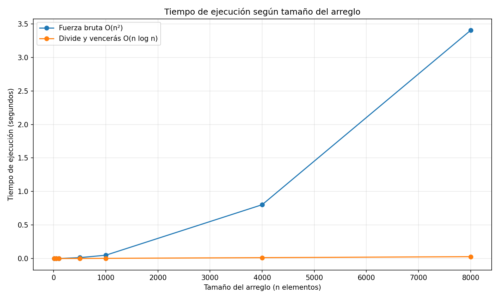

# Laboratorio evaluativo 02 — Dividir y vencer

**Estudiante:** Esneider Guisao Ospina

## Instrucciones de reproducción

Este laboratorio implementa dos algoritmos para encontrar el subarreglo contiguo de suma máxima: fuerza bruta y divide y vencerás.

Requisitos: Python 3 y las dependencias indicadas en `requirements.txt` del repositorio principal, incluida Matplotlib.

Desde la carpeta `lab2-divide-y-vencer`, ejecutar:

```bash
python pruebas.py
python medicion.py
```

El primer comando ejecuta las pruebas automatizadas. El segundo mide los tiempos de ejecución y genera la gráfica `graficas/tiempo_vs_n.png`.

## Parte 1. Implementación y pruebas

**Archivos de implementación:** [subarreglo.py](subarreglo.py) y [pruebas.py](pruebas.py).

Se implementaron tres funciones: `subarreglo_fuerza_bruta`, que examina todos los tramos posibles acumulando sus sumas; `suma_cruzada`, que encuentra el mejor tramo que atraviesa el punto medio; y `subarreglo_maximo`, que divide recursivamente el arreglo y compara las mejores soluciones de la mitad izquierda, la derecha y el tramo cruzado.

La implementación no modifica la lista recibida y el algoritmo de divide y vencerás no utiliza fuerza bruta como parte de su solución.

Las pruebas verifican el ejemplo de la guía, un arreglo de un elemento, valores todos negativos, valores todos positivos, un caso cuya mejor racha cruza el punto medio y 20 arreglos aleatorios. Todas las pruebas fueron superadas. En las comparaciones se verifica la suma máxima, ya que pueden existir tramos distintos con la misma suma.

## Parte 2. Medición experimental

**Archivo de medición:** [medicion.py](medicion.py).

La medición utiliza arreglos de tamaños 10, 50, 100, 500, 1000, 4000 y 8000, con valores enteros aleatorios entre -100 y 100 y semilla fija 42. Para cada tamaño se utilizan los mismos datos en ambos algoritmos. Cada medición se repite tres veces y se toma la mediana. La generación de los datos queda fuera del tiempo medido.

La gráfica generada es:



Los resultados muestran que, con 10 elementos, fuerza bruta tarda aproximadamente 0,000010 segundos y divide y vencerás 0,000020 segundos. Para tamaños mayores, divide y vencerás presenta mejores tiempos. Con 8000 elementos, fuerza bruta tarda 3,404036 segundos, frente a 0,027968 segundos de divide y vencerás.

## Parte 3. Análisis

### 1. Complejidad de los algoritmos

El algoritmo de fuerza bruta tiene complejidad temporal \(\Theta(n^2)\). Utiliza dos ciclos anidados para considerar los posibles inicios y finales de los tramos. Como acumula cada suma durante el recorrido, el número total de operaciones crece proporcionalmente a \(1+2+\cdots+n\), que pertenece a \(\Theta(n^2)\).

Para divide y vencerás, la recurrencia es \(T(n)=2T(n/2)+\Theta(n)\). Se resuelven dos subproblemas de tamaño aproximado \(n/2\), y encontrar la mejor suma que cruza el punto medio requiere un recorrido lineal. En el teorema maestro, \(a=2\), \(b=2\) y \(f(n)=\Theta(n)\). Como \(n^{\log_b a}=n\), corresponde al caso 2, por lo que la complejidad es \(\Theta(n\log n)\).

### 2. Comparación de los tiempos experimentales

Al duplicar el tamaño de 4000 a 8000 elementos, fuerza bruta pasa de 0,802826 a 3,404036 segundos, aproximadamente 4,24 veces su tiempo anterior. Esto se aproxima al crecimiento cuadrático esperado, aunque las mediciones pueden variar por factores del entorno.

Divide y vencerás pasa de 0,013240 a 0,027968 segundos, aproximadamente 2,11 veces. Este crecimiento es cercano al esperado para \(\Theta(n\log n)\), donde duplicar el tamaño produce un incremento algo mayor que el doble. En general, los resultados experimentales concuerdan con las tendencias teóricas.

### 3. ¿A partir de qué tamaño conviene divide y vencerás?

En las mediciones realizadas, divide y vencerás ya es más rápido con 50 elementos, aunque la diferencia es pequeña. Con 100 elementos la ventaja es más clara: tarda 0,000243 segundos frente a 0,000451 segundos de fuerza bruta. Para tamaños de 500 elementos en adelante, la diferencia aumenta considerablemente. El punto exacto de cruce depende del equipo y del entorno de ejecución.

### 4. ¿Qué sucede al buscar el máximo de un arreglo?

Para encontrar el elemento máximo basta recorrer el arreglo una vez, manteniendo el mayor valor encontrado. Este algoritmo tiene complejidad \(\Theta(n)\). Un enfoque de divide y vencerás puede resolver dos mitades y comparar sus máximos mediante la recurrencia \(T(n)=2T(n/2)+\Theta(1)\), que también resulta en \(\Theta(n)\). Por tanto, no mejora el orden asintótico y puede añadir sobrecosto por las llamadas recursivas.

### 5. ¿Qué algoritmo elegir para un millón de registros?

Elegiría divide y vencerás porque su complejidad \(\Theta(n\log n)\) crece mucho más lentamente que \(\Theta(n^2)\). Como estimación teórica orientativa, al pasar de 8000 a 1.000.000 de elementos, el factor de crecimiento de divide y vencerás sería aproximadamente \(\frac{1.000.000\log_2(1.000.000)}{8000\log_2(8000)}\), es decir, cerca de 166. Aplicado al tiempo medido de 0,027968 segundos, daría aproximadamente 4,6 segundos. Esta cifra es una extrapolación aproximada, no una medición real, y el tiempo efectivo dependerá del hardware y de la implementación.

En cambio, fuerza bruta tendría un factor cuadrático de \((1.000.000/8000)^2\), equivalente a 15.625. Su extrapolación sería de varias horas. Esto refuerza la recomendación de utilizar divide y vencerás para conjuntos grandes de datos.
